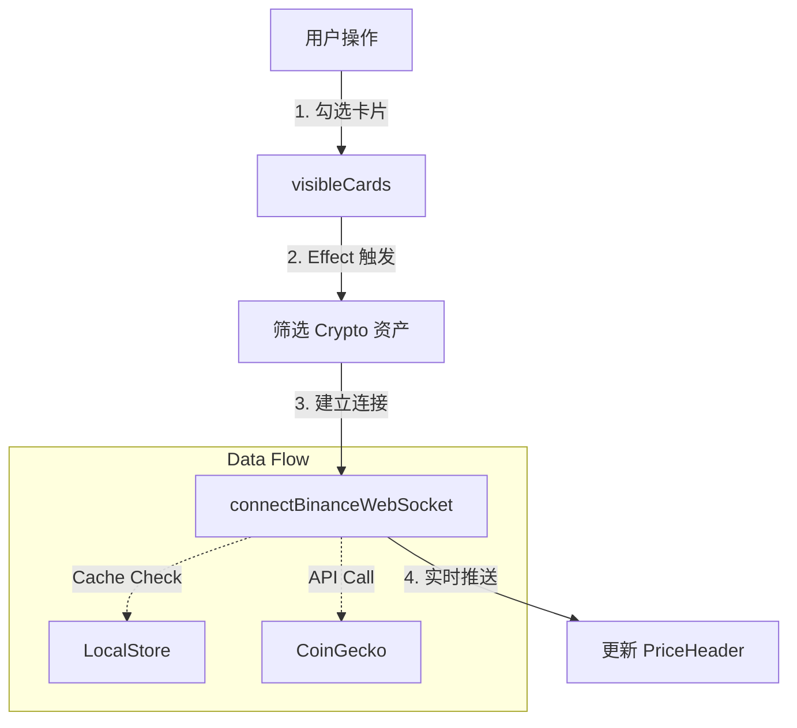

# 🧩 OmniTrade AI - 组件级价格逻辑

本文档说明 UI 组件如何消费数据层的数据，以及如何在组件内部处理与 API 的交互。


## 1. 价格看板 (`PriceHeader.jsx`)

`PriceHeader` 是价格数据的**消费者**和**驱动者**。

### 核心逻辑



1.  **可见性驱动**: 它只获取**当前用户通过筛选器选中**的卡片价格。
    ```javascript
    const visibleCards = cards.filter(c => c.visible);
    ```
2.  **动态订阅**:
    利用 `useEffect` 监听 `visibleCards` 的变化。一旦用户添加了新的卡片（如 SOL），Effect 重新触发：
    ```javascript
    useEffect(() => {
        // 筛选出需要 CoinGecko 价格源的卡片
        const cryptoAssets = visibleCards
            .filter(c => c.priceSource === 'coingecko')
            .map(c => ({ priceId: c.priceId, name: c.name }));
            
        // 建立连接
        const disconnect = connectBinanceWebSocket(updatePrices, cryptoAssets);
        return () => disconnect();
    }, [visibleCards]); // 依赖项：卡片变化时重连
    ```
    **结果**: 新添加的卡片（如 DOGE）能立即获得价格更新，无需刷新页面。

---

## 2. K线图表 (`CryptoChart.jsx`)

该组件经过改造，现在是一个**通用金融图表组件**，不仅限于加密货币。

### Props 定义
*   `coin`: (可选) 加密货币符号，如 "BTC"。
*   `asset`: (可选) 完整资产对象，包含 `ohlcSource` 等配置。

### 智能数据路由
组件内部判断逻辑：
```javascript
const loadData = async () => {
    if (asset) {
        // 如果传入了 asset 对象（即股票或配置了特定源的加密货币）
        // 调用通用接口，支持 Yahoo/Sina/OKX 等所有源
        data = await fetchOHLCByAsset(asset);
    } else {
        // 旧模式兼容：只传 coin，默认为加密货币
        data = await fetchOHLCData(coin);
    }
}
```

---

## 3. 市场情报模态框 (`NewsDetailModal` in `NewsGrid.jsx`)

这里解决了 "点击罗技/英伟达新闻显示错误图表" 的问题。

### 之前的 Bug
模态框只接收 `selectedCoin` (字符串)，导致内部 `CryptoChart` 只能调用加密货币 API。对于股票代码（如 "LOGI"），API 会去 OKX 查找 "LOGI-USDT"，自然失败。

### 修复后的逻辑
1.  **传递完整对象**: `NewsGrid` 现在将 `selectedAsset` (完整对象) 传递给模态框。
2.  **透传给图表**:
    ```jsx
    <CryptoChart 
        coin={selectedCoin} 
        asset={selectedAsset} // 新增：传入完整资产信息
        height={350} 
    />
    ```
3.  **结果**: 
    *   点击 "Bitcoin" -> `asset` 为空 -> 走 `fetchOHLCData` -> OKX/Binance
    *   点击 "NVIDIA" -> `asset` 存在且 source='yahoo' -> 走 `fetchYahooOHLC` -> Correct Chart ✅

---

## 4. 技术指标计算 (`indicators.js`)

虽然不涉及网络请求，但这里是**数据分析**的关键部分。

### 计算逻辑
我们使用 `technicalindicators` 库进行标准计算，确保所有技术指标（Vegas 通道, RSI, ATR）的准确性。输出结果直接供 AI 分析师使用，由 AI 提供通俗易懂的解读。
